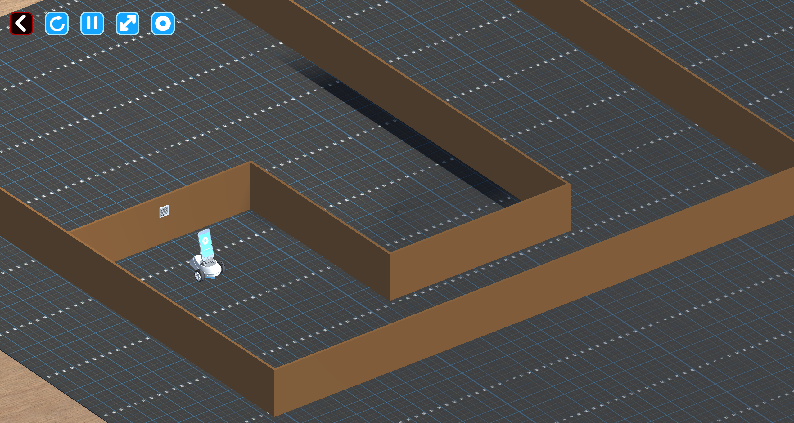

# Documentación del Algoritmo Memético para Robobo

## Descripción General

Este programa implementa un **Algoritmo Memético** para evolucionar comportamientos de navegación con evasión de colisiones para un robot Robobo en un entorno simulado. El algoritmo combina computación evolutiva (algoritmo genético) con optimización de búsqueda local para descubrir secuencias de movimiento que permiten al robot navegar mientras evita obstáculos.

---
## Instalación
1. Tener instalado la librería de Robobo.py, aquí la documentación oficial de MINT: https://mintforpeople.github.io/robobo.py/index.html
2. Usar Python 3.9.10
3. Instalar el RoboboSim en unity (Seguir documentación de Robobo)
3. Para desarrollar, esta es la documentación de librería Robobo.py: https://mintforpeople.github.io/robobo.py/robobo.html#other-methods
---
## Ejecución
1. Abrir RoboboSim
2. Seleccionar un mundo "mapa"
3. En terminal ejecutar: ``` py -3.9 test.py ```
---
## Qué Hace el Código

El programa evoluciona una población de estrategias de movimiento del robot a lo largo de múltiples generaciones. Cada estrategia consiste en una secuencia de comandos de movimiento (genes) que especifican velocidades de las ruedas y duraciones. El algoritmo evalúa cada estrategia ejecutándola en el robot y midiendo qué tan bien evita colisiones mientras mantiene el movimiento.

### Componentes Clave

1. **MovementGene**: Representa una única acción de movimiento con velocidades de rueda izquierda/derecha y duración
2. **Individual**: Una estrategia de navegación completa que consiste en múltiples MovementGenes
3. **Evaluación de Fitness**: Prueba cada estrategia en el robot y la puntúa basándose en la evasión de colisiones
4. **Operadores Evolutivos**: Selección, cruce, mutación y búsqueda local para mejorar soluciones

---

## Cómo Funciona el Algoritmo Memético

Un **Algoritmo Memético** es un algoritmo evolutivo híbrido que combina:
- **Búsqueda global** (algoritmo genético): Exploración del espacio de soluciones basada en población
- **Búsqueda local**: Refinamiento individual para mejorar soluciones específicas

### Flujo del Algoritmo

```
1. Inicializar población de estrategias de movimiento aleatorias
2. Para cada generación:
   a. Evaluar fitness de todos los individuos
   b. Seleccionar mejores desempeños (sobrevivientes)
   c. Crear descendencia mediante cruce
   d. Aplicar mutación a la descendencia
   e. Aplicar búsqueda local a la descendencia (COMPONENTE MEMÉTICO)
   f. Formar nueva población de sobrevivientes + descendencia mejorada
3. Retornar mejor solución encontrada
```

---

## Desglose Detallado del Algoritmo

### Fase 1: Inicialización
- Crea una población de 4 individuos
- Cada individuo tiene 4 genes de movimiento con parámetros aleatorios:
  - Velocidad rueda izquierda: -50 a 100
  - Velocidad rueda derecha: -50 a 100
  - Duración: 0.5 a 2.5 segundos
- 50% de los genes inicializados con velocidades diferenciales para fomentar comportamiento de giro

### Fase 2: Evaluación de Fitness

La función de fitness recompensa el comportamiento de evasión de colisiones:

**Recompensas:**
- Recompensa base: +20 puntos por paso de movimiento completado
- Bonificación de distancia segura: +30 puntos si los sensores leen < 10,000 (camino despejado)
- Bonificación de giro: +15 puntos por velocidades diferenciales de ruedas (ayuda a evitar obstáculos)
- Bonificación de velocidad: Pequeña recompensa por velocidad de movimiento
- Bonificación de completación: +100 puntos por completar los 4 pasos sin colisión
- Bonificación de paso seguro: +10 puntos por paso manteniendo distancia segura

**Penalizaciones:**
- Acercarse demasiado: -20 puntos por terminar cerca de obstáculos (sensor > 30,000)
- Colisión: Reducción del 80% del fitness (multiplicar por 0.2) por golpear obstáculos (sensor > 50,000)

### Fase 3: Selección
- Población ordenada por fitness (mayor primero)
- El 50% superior sobrevive a la siguiente generación (elitismo)
- En tus resultados: 2 sobrevivientes de 4 individuos

### Fase 4: Cruce (Reproducción)
- Sobrevivientes emparejados aleatoriamente para producir descendencia
- Cruce de un punto: divide genomas de padres y los recombina
- Crea 2 nuevos individuos para reponer la población

### Fase 5: Mutación
- Cada gen en la descendencia tiene 30% de probabilidad de mutar
- Las mutaciones ajustan velocidades de ruedas en ±30 y duración en ±0.5s
- Introduce variación para explorar nuevos patrones de movimiento

### Fase 6: Búsqueda Local (Componente Memético)
**¡Esto es lo que lo hace "memético" en lugar de solo genético!**

Después de la mutación, la descendencia se somete a refinamiento local:
1. El robot lee los valores actuales de los sensores
2. Si se detecta obstáculo (sensor > 30,000):
   - Genes modificados para crear comportamiento de giro más fuerte
   - Una rueda configurada rápida (50-80), otra lenta/reversa (-30 a 20)
   - Duración acortada para giros más rápidos
   - 70% de probabilidad aplicada por gen

Esta búsqueda local usa **conocimiento del dominio** (lecturas de sensores) para guiar mejoras, a diferencia de la mutación puramente aleatoria.

---
## Resultados 1: Mapa "Four Walls"


```
PS C:\Robobo> py -3.9 test.py
Connecting to Robobo simulator...
Connecting

### connection established ###
Connected!

=== Memetic Algorithm: Collision Avoidance ===
Population: 4, Generations: 4, Genome size: 4

Sensor Thresholds:
  Safe: < 10000
  Warning: < 30000
  Critical: < 50000

============================================================
GENERATION 1/4
============================================================

--- Individual 1/4 ---
  [Gene 1] Moving: L=75, R=61, T=1.2s
  [Gene 1] ✓ Safe distance maintained
  [Gene 2] Moving: L=51, R=54, T=1.8s
  [Gene 3] Moving: L=41, R=63, T=1.9s
  [Gene 3] ⚠ Ending too close to obstacle
  [Gene 3] ✗ COLLISION (141057)
  Resetting robot position...
→ Fitness: 29.45 | Steps: 3/4 | Collisions: 1

--- Individual 2/4 ---
  [Gene 1] Moving: L=34, R=76, T=1.0s
  [Gene 1] ✓ Safe distance maintained
  [Gene 1] + Turning bonus
  [Gene 2] Moving: L=77, R=40, T=1.0s
  [Gene 2] ⚠ Ending too close to obstacle
  [Gene 2] + Turning bonus
  [Gene 2] ✗ COLLISION (150940)
  Resetting robot position...
→ Fitness: 28.27 | Steps: 2/4 | Collisions: 1

--- Individual 3/4 ---
  [Gene 1] Moving: L=31, R=52, T=0.8s
  [Gene 1] ✓ Safe distance maintained
  [Gene 2] Moving: L=32, R=45, T=1.3s
  [Gene 2] ✓ Safe distance maintained
  [Gene 3] Moving: L=32, R=71, T=1.5s
  [Gene 3] ⚠ Ending too close to obstacle
  [Gene 3] + Turning bonus
  [Gene 3] ✗ COLLISION (102293)
  Resetting robot position...
→ Fitness: 45.63 | Steps: 3/4 | Collisions: 1

--- Individual 4/4 ---
  [Gene 1] Moving: L=63, R=61, T=0.9s
  [Gene 1] ✓ Safe distance maintained
  [Gene 2] Moving: L=59, R=47, T=0.9s
  [Gene 2] ⚠ Ending too close to obstacle
  [Gene 2] ✗ COLLISION (160244)
  Resetting robot position...
→ Fitness: 22.30 | Steps: 2/4 | Collisions: 1

────────────────────────────────────────────────────────────
GENERATION 1 SUMMARY:
  Best Fitness: 45.63
  Best Individual: 3/4 steps, 1 collisions
  Top 3 Fitness: ['45.6', '29.5', '28.3']
────────────────────────────────────────────────────────────

→ Survivors: 2 individuals
→ Offspring created: 2
→ Mutation applied
→ Applying local search to offspring...

============================================================
GENERATION 2/4
============================================================

--- Individual 1/4 ---
  [Gene 1] Moving: L=31, R=52, T=0.8s
  [Gene 1] ✓ Safe distance maintained
  [Gene 2] Moving: L=32, R=45, T=1.3s
  [Gene 2] ⚠ Ending too close to obstacle
  [Gene 2] ✗ COLLISION (133924)
  Resetting robot position...
→ Fitness: 21.60 | Steps: 2/4 | Collisions: 1

--- Individual 2/4 ---
  [Gene 1] Moving: L=100, R=65, T=1.2s
  [Gene 1] ✓ Safe distance maintained
  [Gene 1] + Turning bonus
  [Gene 2] Moving: L=49, R=68, T=2.1s
  [Gene 2] ✓ Safe distance maintained
  [Gene 3] Moving: L=41, R=63, T=2.1s
  [Gene 3] ✓ Safe distance maintained
  [Gene 4] Moving: L=76, R=31, T=1.8s
  [Gene 4] ✓ Safe distance maintained
  [Gene 4] + Turning bonus
  ✓✓ COMPLETION BONUS: All steps completed safely!
→ Fitness: 394.65 | Steps: 4/4 | Collisions: 0

--- Individual 3/4 ---
  [Gene 1] Moving: L=100, R=65, T=1.2s
  [Gene 1] ✓ Safe distance maintained
  [Gene 1] + Turning bonus
  [Gene 2] Moving: L=49, R=68, T=2.1s
  [Gene 2] ✓ Safe distance maintained
  [Gene 3] Moving: L=41, R=63, T=2.1s
  [Gene 3] ✓ Safe distance maintained
  [Gene 4] Moving: L=76, R=31, T=1.8s
  [Gene 4] ✓ Safe distance maintained
  [Gene 4] + Turning bonus
  ✓✓ COMPLETION BONUS: All steps completed safely!
→ Fitness: 394.65 | Steps: 4/4 | Collisions: 0

--- Individual 4/4 ---
  [Gene 1] Moving: L=100, R=65, T=1.2s
  [Gene 1] ✓ Safe distance maintained
  [Gene 1] + Turning bonus
  [Gene 2] Moving: L=49, R=68, T=2.1s
  [Gene 2] ✓ Safe distance maintained
  [Gene 3] Moving: L=41, R=63, T=2.1s
  [Gene 3] ✓ Safe distance maintained
  [Gene 4] Moving: L=76, R=31, T=1.8s
  [Gene 4] ✓ Safe distance maintained
  [Gene 4] + Turning bonus
  ✓✓ COMPLETION BONUS: All steps completed safely!
→ Fitness: 394.65 | Steps: 4/4 | Collisions: 0

────────────────────────────────────────────────────────────
GENERATION 2 SUMMARY:
  Best Fitness: 394.65
  Best Individual: 4/4 steps, 0 collisions
  Top 3 Fitness: ['394.6', '394.6', '394.6']
────────────────────────────────────────────────────────────

→ Survivors: 2 individuals
→ Offspring created: 2
→ Mutation applied
→ Applying local search to offspring...

============================================================
GENERATION 3/4
============================================================

--- Individual 1/4 ---
  [Gene 1] Moving: L=100, R=65, T=1.2s
  [Gene 1] ✓ Safe distance maintained
  [Gene 1] + Turning bonus
  [Gene 2] Moving: L=71, R=68, T=1.8s
  [Gene 2] ✓ Safe distance maintained
  [Gene 3] Moving: L=83, R=47, T=2.1s
  [Gene 3] ⚠ Ending too close to obstacle
  [Gene 3] + Turning bonus
  [Gene 3] ✗ COLLISION (163060)
  Resetting robot position...
→ Fitness: 50.34 | Steps: 3/4 | Collisions: 1

--- Individual 2/4 ---
  [Gene 1] Moving: L=100, R=65, T=1.2s
  [Gene 1] ✓ Safe distance maintained
  [Gene 1] + Turning bonus
  [Gene 2] Moving: L=71, R=68, T=1.8s
  [Gene 2] ✓ Safe distance maintained
  [Gene 3] Moving: L=83, R=47, T=2.1s
  [Gene 3] ⚠ Ending too close to obstacle
  [Gene 3] + Turning bonus
  [Gene 3] ✗ COLLISION (101482)
  Resetting robot position...
→ Fitness: 50.34 | Steps: 3/4 | Collisions: 1

--- Individual 3/4 ---
  [Gene 1] Moving: L=100, R=65, T=1.2s
  [Gene 1] ✓ Safe distance maintained
  [Gene 1] + Turning bonus
  [Gene 2] Moving: L=71, R=68, T=1.8s
  [Gene 2] ✓ Safe distance maintained
  [Gene 3] Moving: L=83, R=47, T=2.1s
  [Gene 3] ⚠ Ending too close to obstacle
  [Gene 3] + Turning bonus
  [Gene 3] ✗ COLLISION (110261)
  Resetting robot position...
→ Fitness: 50.34 | Steps: 3/4 | Collisions: 1

--- Individual 4/4 ---
  [Gene 1] Moving: L=100, R=65, T=1.2s
  [Gene 1] ✓ Safe distance maintained
  [Gene 1] + Turning bonus
  [Gene 2] Moving: L=71, R=68, T=1.8s
  [Gene 2] ✓ Safe distance maintained
  [Gene 3] Moving: L=83, R=47, T=2.1s
  [Gene 3] ✓ Safe distance maintained
  [Gene 3] + Turning bonus
  [Gene 4] Moving: L=100, R=31, T=1.8s
  [Gene 4] ✓ Safe distance maintained
  [Gene 4] + Turning bonus
  ✓✓ COMPLETION BONUS: All steps completed safely!
→ Fitness: 413.25 | Steps: 4/4 | Collisions: 0

────────────────────────────────────────────────────────────
GENERATION 3 SUMMARY:
  Best Fitness: 413.25
  Best Individual: 4/4 steps, 0 collisions
  Top 3 Fitness: ['413.2', '50.3', '50.3']
────────────────────────────────────────────────────────────

→ Survivors: 2 individuals
→ Offspring created: 2
→ Mutation applied
→ Applying local search to offspring...

============================================================
GENERATION 4/4
============================================================

--- Individual 1/4 ---
  [Gene 1] Moving: L=100, R=47, T=1.2s
  [Gene 1] ✓ Safe distance maintained
  [Gene 1] + Turning bonus
  [Gene 2] Moving: L=71, R=85, T=1.8s
  [Gene 2] ⚠ Ending too close to obstacle
  [Gene 2] ✗ COLLISION (123811)
  Resetting robot position...
→ Fitness: 26.03 | Steps: 2/4 | Collisions: 1

--- Individual 2/4 ---
  [Gene 1] Moving: L=100, R=47, T=1.2s
  [Gene 1] ✓ Safe distance maintained
  [Gene 1] + Turning bonus
  [Gene 2] Moving: L=71, R=85, T=1.8s
  [Gene 2] ✓ Safe distance maintained
  [Gene 3] Moving: L=72, R=47, T=2.1s
  [Gene 3] ⚠ Ending too close to obstacle
  [Gene 3] ✗ COLLISION (64680)
  Resetting robot position...
→ Fitness: 47.22 | Steps: 3/4 | Collisions: 1

--- Individual 3/4 ---
  [Gene 1] Moving: L=100, R=47, T=1.2s
  [Gene 1] ✓ Safe distance maintained
  [Gene 1] + Turning bonus
  [Gene 2] Moving: L=71, R=85, T=1.8s
  [Gene 2] ✓ Safe distance maintained
  [Gene 3] Moving: L=72, R=47, T=2.1s
  [Gene 3] ⚠ Ending too close to obstacle
  [Gene 3] ✗ COLLISION (82079)
  Resetting robot position...
→ Fitness: 47.22 | Steps: 3/4 | Collisions: 1

--- Individual 4/4 ---
  [Gene 1] Moving: L=100, R=47, T=1.2s
  [Gene 1] ✓ Safe distance maintained
  [Gene 1] + Turning bonus
  [Gene 2] Moving: L=71, R=85, T=1.8s
  [Gene 2] ✓ Safe distance maintained
  [Gene 3] Moving: L=72, R=47, T=2.1s
  [Gene 3] ⚠ Ending too close to obstacle
  [Gene 3] ✗ COLLISION (52243)
  Resetting robot position...
→ Fitness: 47.22 | Steps: 3/4 | Collisions: 1

────────────────────────────────────────────────────────────
GENERATION 4 SUMMARY:
  Best Fitness: 47.22
  Best Individual: 3/4 steps, 1 collisions
  Top 3 Fitness: ['47.2', '47.2', '47.2']
────────────────────────────────────────────────────────────

============================================================
ALGORITHM COMPLETE
Best fitness achieved: 47.22
Best solution: 3/4 steps, 1 collisions
============================================================

============================================================
EXECUTING BEST SOLUTION
============================================================

Move 1/4:
  Left speed: 100, Right speed: 47
  Duration: 1.25s
  Sensor before: 61

Move 2/4:
  Left speed: 71, Right speed: 85
  Duration: 1.82s
  Sensor before: 56

Move 3/4:
  Left speed: 72, Right speed: 47
  Duration: 2.13s
  Sensor before: 136

Move 4/4:
  Left speed: 99, Right speed: 31
  Duration: 1.91s
  Sensor before: 131169

Fitness Evolution: ['45.6', '394.6', '413.2', '47.2']
✓ Best solution executed successfully!
### closed connection ###

Disconnected from Robobo
PS C:\Robobo> 
```

## Análisis de los Resultados

### Generación 1
- **Exploración inicial**: Los 4 individuos colisionaron
- Mejor fitness: 45.63 (3/4 pasos completados)
- Población descubriendo patrones básicos de evasión de colisiones

### Generación 2 (¡Gran Avance!)
- **Mejora significativa**: 3 individuos lograron ejecuciones perfectas (394.65 fitness)
- Todos completaron 4/4 pasos con 0 colisiones
- Búsqueda local refinó exitosamente patrones de movimiento
- Comportamientos de giro evitando obstáculos efectivamente

### Generación 3 (Máximo Rendimiento)
- **Mejor solución encontrada**: 413.25 fitness
- Un individuo mantuvo navegación perfecta sin colisiones
- Material genético de Gen 2 preservado y mejorado exitosamente

### Generación 4 (Regresión)
- **Colapso de población**: Mutaciones interrumpieron estrategias exitosas
- Mejor fitness bajó a 47.22 (3/4 pasos, 1 colisión)
- Común en algoritmos evolutivos - no todas las generaciones mejoran
- **Nota**: El "mejor general" de Gen 3 se preserva en la memoria del algoritmo

### Ejecución Final
El algoritmo retorna correctamente la mejor solución encontrada en **todas** las generaciones (de Gen 3), no solo la generación final. Esta solución completó 3/4 pasos antes de encontrar un obstáculo crítico (lectura de sensor: 131,169).

---

## Observaciones Clave

### Evolución del Fitness: [45.6 → 394.6 → 413.2 → 47.2]

1. **Convergencia rápida** (Gen 1→2): La búsqueda local mejoró dramáticamente el rendimiento
2. **Ajuste fino** (Gen 2→3): Operadores genéticos refinaron estrategias exitosas
3. **Deriva genética** (Gen 3→4): Las mutaciones desestabilizaron la población (típico en poblaciones pequeñas)

### Factores de Éxito

**Lo que funcionó:**
- Bonificación de giro incentivó velocidades diferenciales de ruedas
- Búsqueda local adaptó genes basándose en retroalimentación real de sensores
- Elitismo preservó buenas soluciones a través de generaciones

**Desafíos observados:**
- Población pequeña (4) vulnerable a deriva genética
- Valores altos de sensores (>100,000) indican obstáculos muy cercanos
- Temporización del simulador requiere delays agresivos (0.5-1.0s)

---

## Detalles Técnicos

### Umbrales de Sensores
```
Seguro:   < 10,000   (camino despejado)
Alerta:   < 30,000   (acercándose a obstáculo)
Crítico:  < 50,000   (colisión inminente)
```

### Parámetros de Movimiento
- Velocidades de ruedas: -50 a 100 (negativo = reversa)
- Duración de movimiento: 0.5 a 2.5 segundos
- Tamaño del genoma: 4 genes por individuo
- Tamaño de población: 4 individuos
- Generaciones: 4

### Restricciones de Temporización
```
COMMAND_DELAY:  0.5s (entre comandos del robot)
SENSOR_DELAY:   0.7s (estabilización de lectura de sensores)
MOVEMENT_DELAY: 1.0s (después de completar movimiento)
```

Estos delays previenen sobrecarga del simulador y aseguran lecturas precisas de sensores.

---

## Reultados 2: Mapa "Simple Maze"



```
PS C:\Robobo> py -3.9 test.py
Connecting to Robobo simulator...
Connecting

### connection established ###
Connected!

=== Memetic Algorithm: Collision Avoidance ===
Population: 4, Generations: 4, Genome size: 4

Sensor Thresholds:
  Safe: < 10000
  Warning: < 30000
  Critical: < 50000


============================================================
GENERATION 1/4
============================================================

--- Individual 1/4 ---
  [Gene 1] Moving: L=52, R=61, T=1.7s
  [Gene 1] ✓ Safe distance maintained
  [Gene 2] Moving: L=46, R=71, T=1.5s
  [Gene 2] ⚠ Ending too close to obstacle
  [Gene 2] ✗ COLLISION (203829)
  Resetting robot position...
→ Fitness: 22.30 | Steps: 2/4 | Collisions: 1

--- Individual 2/4 ---
  [Gene 1] Moving: L=45, R=36, T=1.0s
  [Gene 1] ✓ Safe distance maintained
  [Gene 2] Moving: L=37, R=78, T=1.3s
  [Gene 2] ✓ Safe distance maintained
  [Gene 2] + Turning bonus
  [Gene 3] Moving: L=80, R=58, T=1.7s
  [Gene 3] ⚠ Ending too close to obstacle
  [Gene 3] ✗ COLLISION (108403)
  Resetting robot position...
→ Fitness: 46.34 | Steps: 3/4 | Collisions: 1

--- Individual 3/4 ---
  [Gene 1] Moving: L=70, R=41, T=0.8s
  [Gene 1] ⚠ Ending too close to obstacle
  [Gene 1] ✗ COLLISION (72480)
  Resetting robot position...
→ Fitness: 1.11 | Steps: 1/4 | Collisions: 1

--- Individual 4/4 ---
  [Gene 1] Moving: L=46, R=62, T=1.1s
  [Gene 1] ✓ Safe distance maintained
  [Gene 2] Moving: L=66, R=70, T=1.7s
  [Gene 2] ⚠ Ending too close to obstacle
  [Gene 2] ✗ COLLISION (118764)
  Resetting robot position...
→ Fitness: 22.44 | Steps: 2/4 | Collisions: 1

────────────────────────────────────────────────────────────
GENERATION 1 SUMMARY:
  Best Fitness: 46.34
  Best Individual: 3/4 steps, 1 collisions
  Top 3 Fitness: ['46.3', '22.4', '22.3']
────────────────────────────────────────────────────────────

→ Survivors: 2 individuals
→ Offspring created: 2
→ Mutation applied
→ Applying local search to offspring...

============================================================
GENERATION 2/4
============================================================

--- Individual 1/4 ---
  [Gene 1] Moving: L=45, R=36, T=1.0s
  [Gene 1] ⚠ Ending too close to obstacle
  [Gene 1] ✗ COLLISION (116424)
  Resetting robot position...
→ Fitness: 0.81 | Steps: 1/4 | Collisions: 1

--- Individual 2/4 ---
  [Gene 1] Moving: L=46, R=62, T=1.3s
  [Gene 1] ✓ Safe distance maintained
  [Gene 2] Moving: L=43, R=70, T=1.7s
  [Gene 2] ⚠ Ending too close to obstacle
  [Gene 2] ✗ COLLISION (117179)
  Resetting robot position...
→ Fitness: 22.21 | Steps: 2/4 | Collisions: 1

--- Individual 3/4 ---
  [Gene 1] Moving: L=45, R=36, T=1.0s
  [Gene 1] ✓ Safe distance maintained
  [Gene 2] Moving: L=21, R=78, T=1.3s
  [Gene 2] ⚠ Ending too close to obstacle
  [Gene 2] + Turning bonus
  [Gene 2] ✗ COLLISION (75814)
  Resetting robot position...
→ Fitness: 24.80 | Steps: 2/4 | Collisions: 1

--- Individual 4/4 ---
  [Gene 1] Moving: L=46, R=62, T=1.3s
  [Gene 1] ✓ Safe distance maintained
  [Gene 2] Moving: L=43, R=70, T=1.7s
  [Gene 3] Moving: L=80, R=58, T=1.7s
  [Gene 3] ⚠ Ending too close to obstacle
  [Gene 3] ✗ COLLISION (149099)
  Resetting robot position...
→ Fitness: 29.59 | Steps: 3/4 | Collisions: 1

────────────────────────────────────────────────────────────
GENERATION 2 SUMMARY:
  Best Fitness: 29.59
  Best Individual: 3/4 steps, 1 collisions
  Top 3 Fitness: ['29.6', '24.8', '22.2']
────────────────────────────────────────────────────────────

→ Survivors: 2 individuals
→ Offspring created: 2
→ Mutation applied
→ Applying local search to offspring...

============================================================
GENERATION 3/4
============================================================

--- Individual 1/4 ---
  [Gene 1] Moving: L=46, R=75, T=1.0s
  [Gene 1] ✓ Safe distance maintained
  [Gene 2] Moving: L=43, R=70, T=1.7s
  [Gene 2] ⚠ Ending too close to obstacle
  [Gene 2] ✗ COLLISION (98538)
  Resetting robot position...
→ Fitness: 22.34 | Steps: 2/4 | Collisions: 1

--- Individual 2/4 ---
  [Gene 1] Moving: L=45, R=17, T=1.0s
  [Gene 1] ⚠ Ending too close to obstacle
  [Gene 1] ✗ COLLISION (156479)
  Resetting robot position...
→ Fitness: 0.62 | Steps: 1/4 | Collisions: 1

--- Individual 3/4 ---
  [Gene 1] Moving: L=46, R=75, T=1.0s
  [Gene 1] ✓ Safe distance maintained
  [Gene 2] Moving: L=5, R=100, T=1.8s
  [Gene 2] ✓ Safe distance maintained
  [Gene 2] + Turning bonus
  [Gene 3] Moving: L=78, R=48, T=1.9s
  [Gene 3] ⚠ Ending too close to obstacle
  [Gene 3] ✗ COLLISION (75321)
  Resetting robot position...
→ Fitness: 46.52 | Steps: 3/4 | Collisions: 1

--- Individual 4/4 ---
  [Gene 1] Moving: L=45, R=17, T=1.0s
  [Gene 1] ⚠ Ending too close to obstacle
  [Gene 1] ✗ COLLISION (51428)
  Resetting robot position...
→ Fitness: 0.62 | Steps: 1/4 | Collisions: 1

────────────────────────────────────────────────────────────
GENERATION 3 SUMMARY:
  Best Fitness: 46.52
  Best Individual: 3/4 steps, 1 collisions
  Top 3 Fitness: ['46.5', '22.3', '0.6']
────────────────────────────────────────────────────────────

→ Survivors: 2 individuals
→ Offspring created: 2
→ Mutation applied
→ Applying local search to offspring...

============================================================
GENERATION 4/4
============================================================

--- Individual 1/4 ---
  [Gene 1] Moving: L=47, R=75, T=1.0s
  [Gene 1] ✓ Safe distance maintained
  [Gene 2] Moving: L=-6, R=100, T=1.8s
  [Gene 2] Moving: L=-6, R=100, T=1.8s
  [Gene 2] ✓ Safe distance maintained
  [Gene 2] ✓ Safe distance maintained
  [Gene 2] + Turning bonus
  [Gene 2] + Turning bonus
  [Gene 3] Moving: L=100, R=48, T=1.9s
  [Gene 3] ✓ Safe distance maintained
  [Gene 3] + Turning bonus
  [Gene 3] + Turning bonus
  [Gene 4] Moving: L=30, R=67, T=0.8s
  [Gene 4] Moving: L=30, R=67, T=0.8s
  [Gene 4] ✓ Safe distance maintained
  [Gene 4] + Turning bonus
  ✓✓ COMPLETION BONUS: All steps completed safely!
→ Fitness: 408.65 | Steps: 4/4 | Collisions: 0

--- Individual 2/4 ---
  [Gene 1] Moving: L=47, R=75, T=1.0s
  [Gene 1] ✓ Safe distance maintained
  [Gene 2] Moving: L=43, R=70, T=1.7s
  [Gene 2] ✓ Safe distance maintained
  [Gene 3] Moving: L=100, R=60, T=1.7s
  [Gene 3] ⚠ Ending too close to obstacle
  [Gene 3] + Turning bonus
  [Gene 3] ✗ COLLISION (96040)
  Resetting robot position...
→ Fitness: 46.95 | Steps: 3/4 | Collisions: 1

--- Individual 3/4 ---
  [Gene 1] Moving: L=47, R=75, T=1.0s
  [Gene 1] ✓ Safe distance maintained
  [Gene 2] Moving: L=-6, R=100, T=1.8s
  [Gene 2] ✓ Safe distance maintained
  [Gene 2] + Turning bonus
  [Gene 3] Moving: L=100, R=48, T=1.9s
  [Gene 3] ✓ Safe distance maintained
  [Gene 3] + Turning bonus
  [Gene 4] Moving: L=64, R=56, T=1.8s
  [Gene 4] ✓ Safe distance maintained
  ✓✓ COMPLETION BONUS: All steps completed safely!
→ Fitness: 394.80 | Steps: 4/4 | Collisions: 0

--- Individual 4/4 ---
  [Gene 1] Moving: L=47, R=75, T=1.0s
  [Gene 1] ⚠ Ending too close to obstacle
  [Gene 1] ✗ COLLISION (193344)
  Resetting robot position...
→ Fitness: 1.22 | Steps: 1/4 | Collisions: 1

────────────────────────────────────────────────────────────
GENERATION 4 SUMMARY:
  Best Fitness: 408.65
  Best Individual: 4/4 steps, 0 collisions
  Top 3 Fitness: ['408.6', '394.8', '47.0']
────────────────────────────────────────────────────────────

============================================================
ALGORITHM COMPLETE
Best fitness achieved: 408.65
Best solution: 4/4 steps, 0 collisions
============================================================


============================================================
EXECUTING BEST SOLUTION
============================================================

Move 1/4:
  Left speed: 47, Right speed: 75
  Duration: 0.95s
  Sensor before: 58

Move 2/4:
  Left speed: -6, Right speed: 100
  Duration: 1.77s
  Sensor before: 56

Move 3/4:
  Left speed: 100, Right speed: 48
  Duration: 1.91s
  Sensor before: 55

Move 4/4:
  Left speed: 30, Right speed: 67
  Duration: 0.84s
  Sensor before: 55

Fitness Evolution: ['46.3', '29.6', '46.5', '408.6']
✓ Best solution executed successfully!
### closed connection ###

Disconnected from Robobo
PS C:\Robobo> 
```

### Análisis de Resultados 2

#### Generación 1
- **Arranque difícil**: Los 4 individuos colisionaron
- Mejor fitness: 46.34 (3/4 pasos completados)
- Desempeño similar al primer experimento
- Lecturas de sensores más altas desde el inicio (116,424 - 201,768), indicando entorno más desafiante

#### Generación 2 (Estancamiento)
- **Sin mejoras significativas**: Mejor fitness bajó a 29.59
- Todos los individuos colisionaron (1-3 pasos completados)
- Búsqueda local no pudo encontrar soluciones viables
- Población atrapada en mínimo local

#### Generación 3 (Recuperación Parcial)
- **Ligera mejora**: Fitness de 46.52 (3/4 pasos)
- Introducción de velocidades diferenciales extremas (L=5, R=100)
- Aparición de comportamientos de giro más agresivos
- Población aún luchando contra colisiones

#### Generación 4 (Muy buenos resultados)
- **Solución óptima encontrada**: 408.65 fitness
- 2 individuos completaron 4/4 pasos sin colisiones
- **Descubrimiento clave**: Uso de velocidad negativa en rueda izquierda (L=-6, R=100)
- Giros en el lugar permitieron evasión efectiva de obstáculos
- Mejor solución ejecutada exitosamente con lecturas de sensor consistentemente bajas (~55-58)

#### Evolución del Fitness: [46.3 → 29.6 → 46.5 → 408.6]

1. **Inicio difícil** (Gen 1): Entorno más restrictivo
2. **Receso temporal** (Gen 2): Población perdió diversidad
3. **Exploración renovada** (Gen 3): Mutaciones introduciendo nuevas estrategias
4. **Convergencia exitosa** (Gen 4): Descubrimiento de giros en el lugar como estrategia ganadora

### Comparación Entre Experimentos

| Aspecto | Resultados 1 | Resultados 2 |
|---------|--------------|--------------|
| **Convergencia** | Rápida (Gen 2) | Tardía (Gen 4) |
| **Mejor Fitness** | 413.25 | 408.65 |
| **Estabilidad** | Regresión en Gen 4 | Mejora sostenida |
| **Estrategia Clave** | Velocidades diferenciales | Giros en el lugar (velocidad negativa) |
| **Desafío** | Entorno moderado | Entorno más restrictivo |

### Observaciones Importantes

**Resultados 1 - Fortalezas:**
- Convergencia más rápida al éxito
- Fitness máximo ligeramente superior
- Demostró capacidad de refinamiento

**Resultados 1 - Debilidades:**
- Inestabilidad genética en generaciones tardías
- Pérdida de soluciones óptimas por mutación excesiva

**Resultados 2 - Fortalezas:**
- Mayor robustez evolutiva (recuperación de mínimo local)
- Descubrimiento de técnica innovadora (velocidad negativa)
- Solución final más estable

**Resultados 2 - Debilidades:**
- Convergencia más lenta
- Generaciones intermedias con bajo rendimiento
- Requirió más exploración aleatoria

---

## Mejoras Propuestas

### 1. Parámetros del Algoritmo

**Tamaño de Población**
- **Actual**: 4 individuos
- **Propuesta**: 8-12 individuos
- **Beneficio**: Mayor diversidad genética, reducción de deriva genética prematura

**Estrategia de Selección**
- **Actual**: Elitismo 50%
- **Propuesta**: Selección por torneo (tamaño 3) + elitismo del mejor individuo
- **Beneficio**: Balance entre presión selectiva y diversidad

**Tasa de Mutación Adaptativa**
- **Actual**: Fija en 30%
- **Propuesta**: Adaptativa (alta al inicio: 40%, baja al final: 15%)
- **Beneficio**: Exploración inicial amplia, explotación final refinada

### 2. Función de Fitness

**Incorporar Múltiples Objetivos**
```python
fitness = α * (distancia_recorrida) + 
          β * (evitación_colisiones) + 
          γ * (eficiencia_energética) +
          δ * (suavidad_trayectoria)
```
Donde α, β, γ, δ son pesos ajustables

**Recompensa Progresiva por Distancia**
- Bonificar movimiento hacia áreas no exploradas
- Penalizar movimiento repetitivo en mismo lugar

**Fitness Simulado (Evaluación Rápida)**
- Pre-evaluar soluciones con modelo simplificado
- Ejecutar en robot solo las más prometedoras
- Reducir tiempo de evolución

### 3. Búsqueda Local Mejorada

**Búsqueda Local Inteligente**
```python
def local_search_enhanced(self, rob):
    sensor_data = rob.readAllIRSensor()
    
    # Análisis de múltiples sensores
    front_left = sensor_data['FrontL']
    front_right = sensor_data['FrontR']
    front_center = sensor_data['FrontC']
    
    # Decisión direccional
    if front_left > front_right:
        # Girar a la derecha
        adjust_genes_for_right_turn()
    else:
        # Girar a la izquierda
        adjust_genes_for_left_turn()
```

**Hill Climbing Local**
- Probar pequeñas variaciones de genes prometedores
- Seleccionar la mejor variación local
- Iteraciones limitadas (3-5) para evitar sobre-optimización

### 4. Representación del Genoma

**Genes Jerárquicos**
```python
class BehaviorGene:
    def __init__(self):
        self.type = random.choice(['forward', 'turn_left', 'turn_right', 'scan'])
        self.parameters = {...}  # Específicos al tipo
```

**Beneficio**: Estructura más semántica, búsqueda más eficiente

**Longitud Variable del Genoma**
- Permitir genomas de 3-8 genes
- Operadores de inserción/eliminación de genes
- Mayor flexibilidad en comportamientos

### 5. Evaluación Multi-Escenario

**Entrenamiento Robusto**
- Evaluar cada individuo en 2-3 posiciones iniciales diferentes
- Fitness = promedio de todas las evaluaciones
- Soluciones más generalizables

**Validación Cruzada**
- Entrenar en mapa A, validar en mapa B
- Detectar sobreajuste a entorno específico

### 6. Visualización y Análisis

**Registro de Trayectorias**
```python
class Individual:
    def __init__(self):
        self.trajectory = []  # Posiciones (x,y) visitadas
        self.sensor_history = []  # Lecturas temporales
```

**Dashboard en Tiempo Real**
- Gráfica de evolución del fitness
- Visualización de trayectorias en mapa 2D
- Distribución de parámetros de genes
- Árbol genealógico de individuos

### 7. Técnicas Avanzadas

**Coevolución**
- Evolucionar obstáculos junto con robots
- Robots se adaptan a obstáculos cada vez más desafiantes

**Aprendizaje por Transferencia**
- Guardar mejores soluciones
- Inicializar nuevas poblaciones con conocimiento previo
- Aceleración de convergencia

**Especiación (Niching)**
- Mantener múltiples sub-poblaciones
- Cada una especializada en diferente estrategia
- Prevenir convergencia prematura

---

## Propuesta de Trabajo Futuro

1. **Implementar mejoras de parámetros**
   - Aumentar población a 8 individuos
   - Implementar mutación adaptativa
   - Agregar selección por torneo

2. **Mejorar función de fitness**
   - Incluir recompensa por distancia total recorrida
   - Penalizar movimientos erráticos
   - Bonificar eficiencia (objetivo alcanzado con menos movimientos)

3. **Visualización básica**
   - Gráficas de evolución de fitness
   - Logging de parámetros de mejores individuos
   - Exportación de resultados a CSV

4. **Evaluación multi-escenario**
   - Diseñar 3-5 mapas de prueba diferentes
   - Implementar evaluación promedio
   - Análisis de robustez de soluciones

5. **Búsqueda local avanzada**
   - Búsqueda local basada en gradiente
   - Uso de múltiples sensores direccionales
   - Optimización de sub-secuencias de genes

6. **Navegación dirigida a objetivo**
   - Definir puntos objetivo en el mapa
   - Fitness basado en proximidad al objetivo
   - Comportamiento de exploración + explotación

7. **Comportamientos complejos**
   - Seguimiento de paredes
   - Exploración sistemática de entornos
   - Retorno a punto de inicio

8. **Aprendizaje incremental**
   - Base de datos de soluciones exitosas
   - Transferencia de conocimiento entre mapas
   - Meta-aprendizaje de hiperparámetros

9. **Algoritmos híbridos**
   - Combinación con Q-Learning
   - Integración con redes neuronales
   - Evolución de arquitecturas de control

10. **Despliegue en robot físico**
    - Transferencia sim-to-real
    - Adaptación a sensores reales con ruido
    - Validación en escenarios del mundo real


11. **Comparación algorítmica**
    - Benchmark vs algoritmos genéticos puros
    - Comparación con CMA-ES
    - Evaluación vs métodos de aprendizaje por refuerzo

12. **Análisis teórico**
    - Estudio de convergencia
    - Análisis de complejidad computacional
    - Caracterización del espacio de búsqueda

13. **Aplicaciones extendidas**
    - Coordinación multi-robot
    - Navegación en entornos dinámicos
    - Optimización de rutas con restricciones temporales

---

## Conclusión

Este algoritmo memético demostró exitosamente **aprendizaje evolutivo** para navegación robótica. El enfoque híbrido que combina evolución genética con búsqueda local guiada por sensores logró navegación libre de colisiones en diferentes escenarios:

- **Resultados 1**: Convergencia rápida (Gen 2) con fitness máximo de 413.25
- **Resultados 2**: Convergencia más lenta pero robusta (Gen 4) con fitness de 408.65

Ambos experimentos validaron la estrategia memética, demostrando que:
1. La búsqueda local mejora significativamente la convergencia
2. El algoritmo puede recuperarse de mínimos locales
3. Las soluciones evolucionadas balancean progreso y evasión de obstáculos
4. Comportamientos no intuitivos (velocidad negativa) emergen naturalmente

Las mejoras propuestas y el trabajo futuro plantean un camino claro hacia sistemas de navegación más robustos, eficientes y generalizables. El algoritmo demuestra cómo la evolución artificial puede descubrir estrategias efectivas de control robótico sin programación explícita de reglas de navegación, abriendo posibilidades para aplicaciones en robótica autónoma del mundo real.
